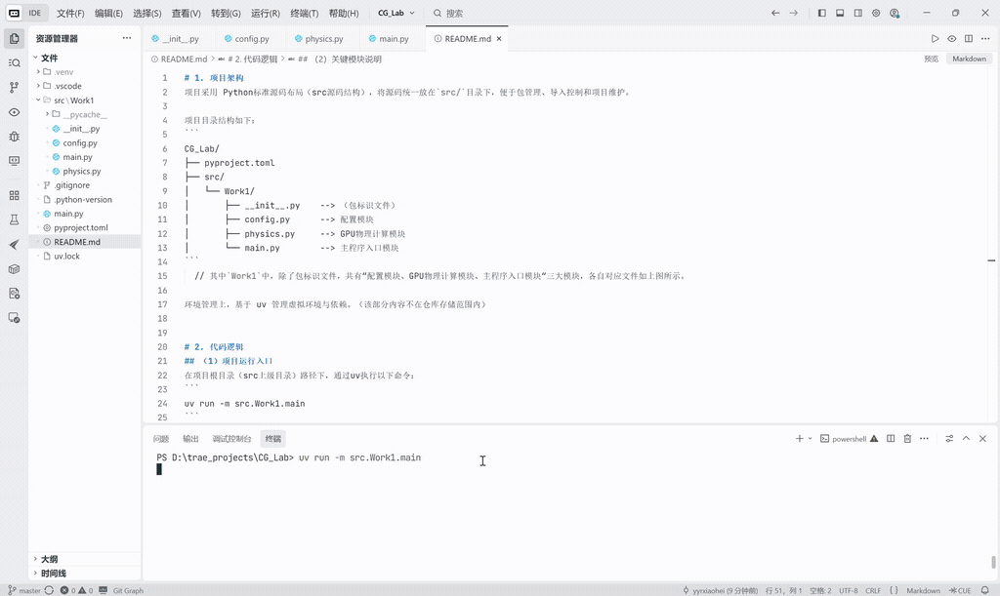
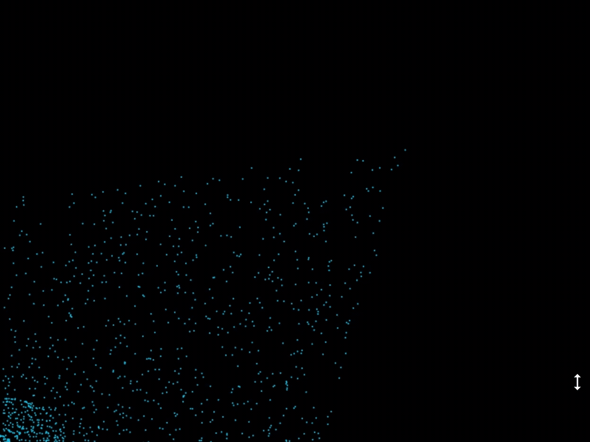
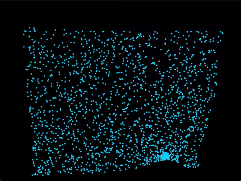

# 1. 项目架构
项目采用 Python标准源码布局（src源码结构），将源码统一放在`src/`目录下，便于包管理、导入控制和项目维护。

项目目录结构如下：
```
CG_Lab/
├── pyproject.toml
├── src/
│   └── Work1/
│       ├── __init__.py    --> （包标识文件）
│       ├── config.py      --> 配置模块
│       ├── physics.py     --> GPU物理计算模块
│       └── main.py        --> 主程序入口模块
```
  // 其中`Work1`中，除了包标识文件，共有“配置模块、GPU物理计算模块、主程序入口模块“三大模块，各自对应文件如上图所示。

环境管理上，基于 uv 管理虚拟环境与依赖。（该部分内容不在仓库存储范围内）


# 2. 代码逻辑
## （1）项目运行入口
在项目根目录（src上级目录）路径下，通过uv执行以下命令：
```
uv run -m src.Work1.main
```
  // 其中，使用 -m 参数（Module 运行模式）让 Python 自动识别 `src` 结构。

## （2）关键模块说明

a. `config.py` **配置模块**
- 核心作用：统一管理所有可调节参数。
- 分组定义：
  - 物理系统参数：粒子总数、鼠标引力强度、空气阻力系数、边界反弹系数；
  - 渲染系统参数：窗口分辨率、粒子绘制半径、粒子颜色值。
- 特点：所有参数为常量，供其他模块直接导入调用，无业务逻辑。

b. `physics.py` **GPU物理计算模块**
- 核心作用：基于 Taichi 实现粒子物理行为的 GPU 并行计算。
- 关键组成：
  - 显存数据定义：创建二维向量场`pos`（粒子坐标）、`vel`（粒子速度），存储于 GPU 显存；
  - 初始化内核`init_particles()`：并行初始化所有粒子为随机坐标、零初始速度；
  - 更新内核`update_particles()`：GPU 并行执行核心物理逻辑 —— 计算鼠标引力、施加空气阻力、更新粒子位置、处理边界碰撞反弹。

c. `main.py` **主程序入口模块**
- 核心作用：统筹程序执行流程，连接物理计算与 GUI 渲染。
- 执行流程：
  - 初始化 Taichi GPU 环境，接管硬件加速；
  - 导入配置参数与物理计算函数；
  - 初始化粒子状态，创建 GUI 渲染窗口；
  - 主循环：实时获取鼠标坐标 → 驱动 GPU 更新粒子物理状态 → 读取显存数据绘制粒子 → 刷新窗口显示

$\downarrow$

**模块协同逻辑**

`config.py`提供统一参数 → `physics.py`基于参数完成 GPU 物理计算 → `main.py`调度计算与渲染，实现完整交互效果。


# 3. 实现功能
基于 Taichi 实现 GPU 加速的交互式粒子引力模拟系统，程序可响应鼠标位置产生引力效果，驱动大量粒子完成流畅的物理运动与碰撞，具体功能如下：
- 粒子物理模拟：实现粒子受鼠标位置吸引的引力效果、空气阻力衰减及窗口边界弹性碰撞物理行为；
- GPU 并行加速：依托 Taichi 后端调用 GPU 算力，支持万级粒子实时流畅计算与渲染；
- 实时鼠标交互：跟随鼠标位置动态改变粒子受力，实现即时可控的粒子集群交互效果；
- 可视化渲染：以固定参数渲染彩色粒子，呈现稳定、清晰的粒子运动画面。


# 4. 效果展示

下面是项目的执行效果展示：



通过调整`config.py`中的参数，可实现不同的物理效果。例如：

改变粒子数量（从左到右`NUM_PARTICLES`依次为1000、5000、10000）：

  

改变引力强度（从左到右`GRAVITY_STRENGTH`依次为0.0001、0.001、0.01）：

  

以及其他参数调整（左`PARTICLE_RADIUS`为3，右`PARTICLE_COLOR`为`0x00BFFF`）：

 
