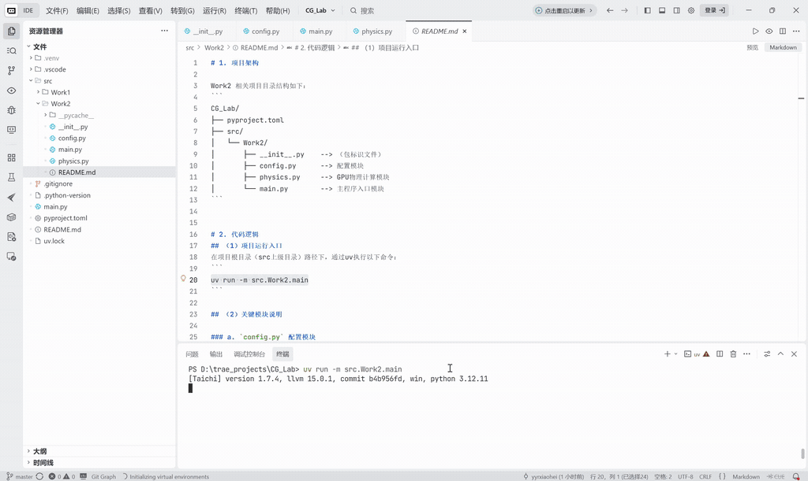
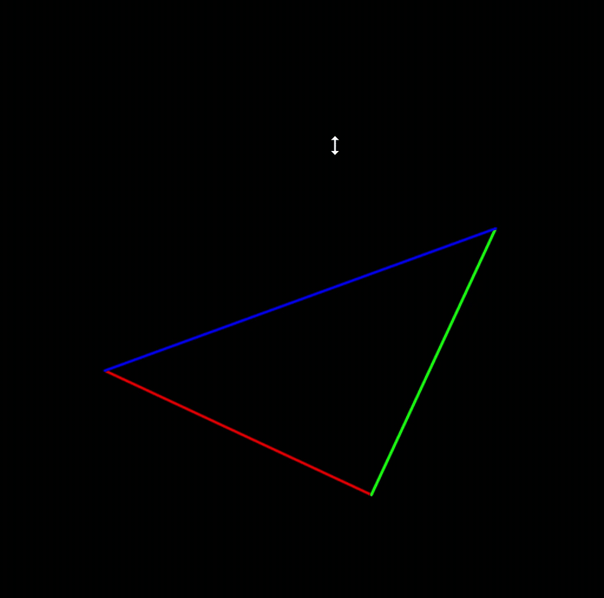
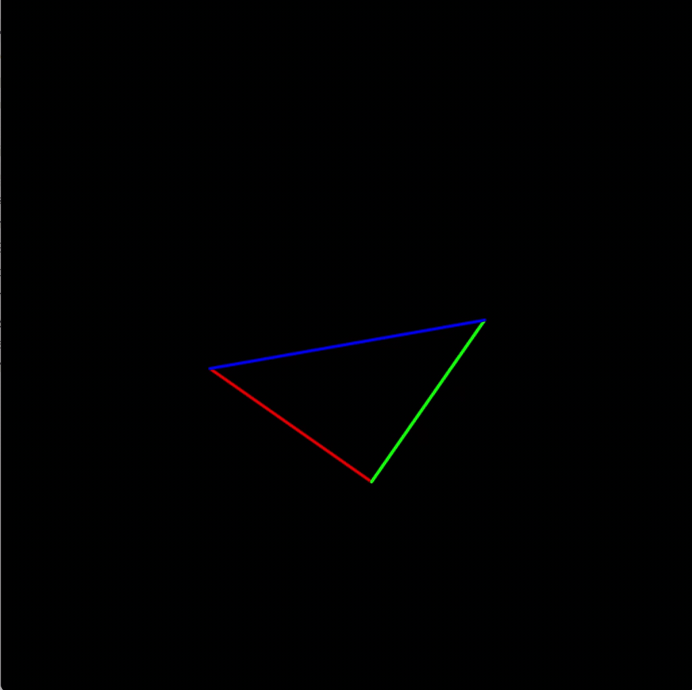
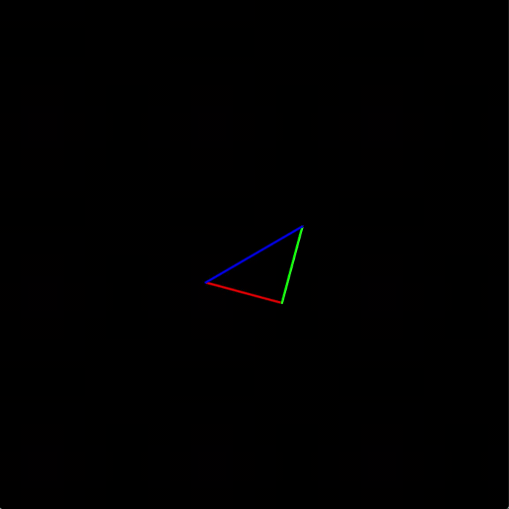

# 1. 项目架构

Work2 相关项目目录结构如下：
```
CG_Lab/
├── pyproject.toml
├── src/
│   └── Work2/
│       ├── __init__.py    --> （包标识文件）
│       ├── config.py      --> 配置模块
│       ├── physics.py     --> GPU物理计算模块
│       └── main.py        --> 主程序入口模块
```


# 2. 代码逻辑
## （1）项目运行入口
在项目根目录（src上级目录）路径下，通过uv执行以下命令：
```
uv run -m src.Work2.main
```

## （2）关键模块说明

### a. `config.py` 配置模块
- 核心作用：统一管理三维变换与渲染相关的全局参数。
- 分组定义：
  - 窗口参数：窗口分辨率 `WINDOW_RES`
  - 几何参数：顶点数量 `VERTICE_NUM`、空间维度 `SPATIAL_DIMENSION`
  - 相机参数：相机位置 `EYE_POS_X/Y/Z`
  - 投影参数：视场角 `EYE_FOV`、宽高比 `ASPECT_RATIO`、近远裁剪面 `Z_NEAR / Z_FAR`
- 特点：所有参数均为常量配置，无计算逻辑，供其他模块直接调用。


### b. `physics.py` 几何变换计算模块（GPU）
- 核心作用：基于 Taichi 实现三维几何体的坐标变换计算（MVP 变换）。

#### （1）显存数据定义
- `vertices`：三维空间中的顶点坐标（模型空间）
- `screen_coords`：二维屏幕坐标（投影后结果）

#### （2）三大变换矩阵函数
- `get_model_matrix(angle)`
  - 模型变换（Model）
  - 功能：绕 Z 轴对模型进行旋转
- `get_view_matrix(eye_pos)`
  - 观察变换（View）
  - 功能：将相机平移到原点（等价于场景反向平移）
- `get_projection_matrix(eye_fov, aspect_ratio, zNear, zFar)`
  - 投影变换（Projection）
  - 功能：
    - 实现透视投影
    - 将视锥体映射到标准立方体（NDC）

#### （3）核心计算内核
- `update_coordinates(angle)`
  - GPU 并行执行：
    - 构建 MVP 矩阵（Model → View → Projection）
    - 对每个顶点执行齐次坐标变换
    - 执行透视除法（Perspective Divide）
    - 映射到屏幕坐标


### c. `main.py` 主程序入口模块
- 核心作用：控制程序流程，实现交互与可视化渲染。
- 执行流程：
  - 初始化 Taichi GPU 环境
  - 定义三角形顶点（模型空间）
  - 创建 GUI 渲染窗口
  - 主循环：
    - 捕获键盘输入（A / D 控制旋转）
    - 调用 GPU 内核更新顶点坐标
    - 获取投影后的二维坐标
    - 绘制三角形边框
    - 刷新窗口显示

### 模块协同逻辑
`config.py` 提供统一参数 →  
`physics.py` 完成 GPU 上的三维变换计算（MVP） →  
`main.py` 负责交互控制与结果渲染 →  
最终实现完整的三维图形变换与可视化流程。


# 3. 实现功能

基于 Taichi 实现 GPU 加速的三维变换与投影系统，完成从三维模型到二维屏幕的坐标映射，并支持基础交互控制。具体功能如下：

- 三维变换：实现模型变换、观察变换与投影变换（MVP 流程），完成三维坐标的统一变换；
- 透视投影：构建透视投影矩阵，实现三维到二维的透视成像效果（远小近大）；
- GPU 并行计算：基于 Taichi 后端调用 GPU，对顶点变换过程进行并行加速计算；
- 实时交互控制：支持键盘输入控制模型旋转（A / D），实现动态变化效果；
- 可视化渲染：绘制彩色线框三角形，并实时刷新显示结果。


# 4. 效果展示

下面是项目的执行效果展示：



通过调整`config.py`中的独立出的参数，可实现不同的视觉效果。例如：

改变相机位置（从左到右`EYE_POS_Z`依次为5、10、20）：

  