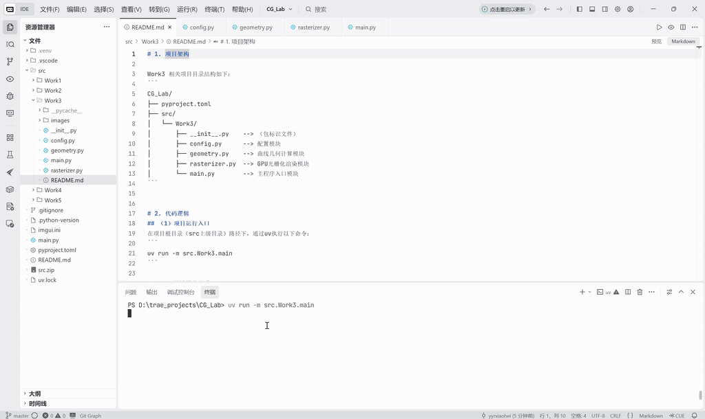
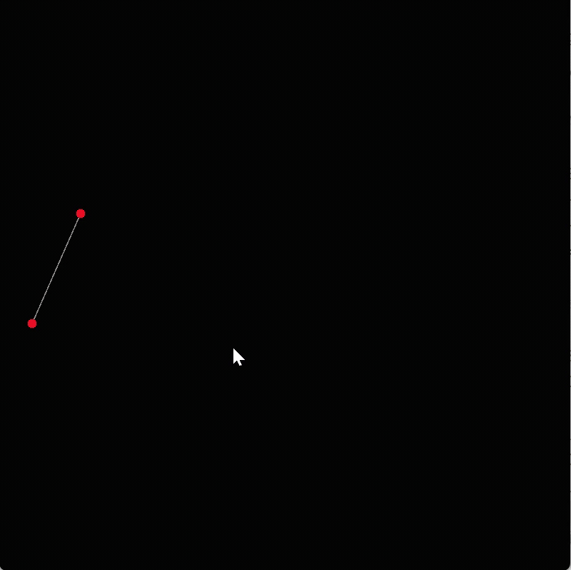
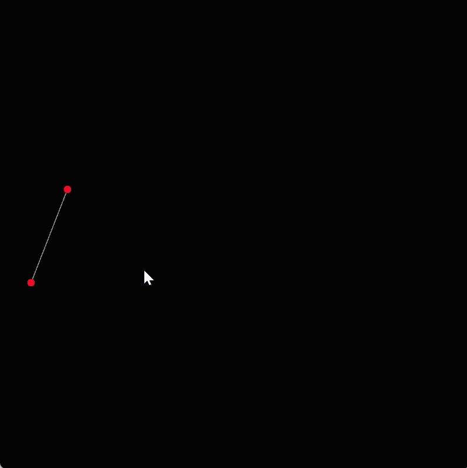
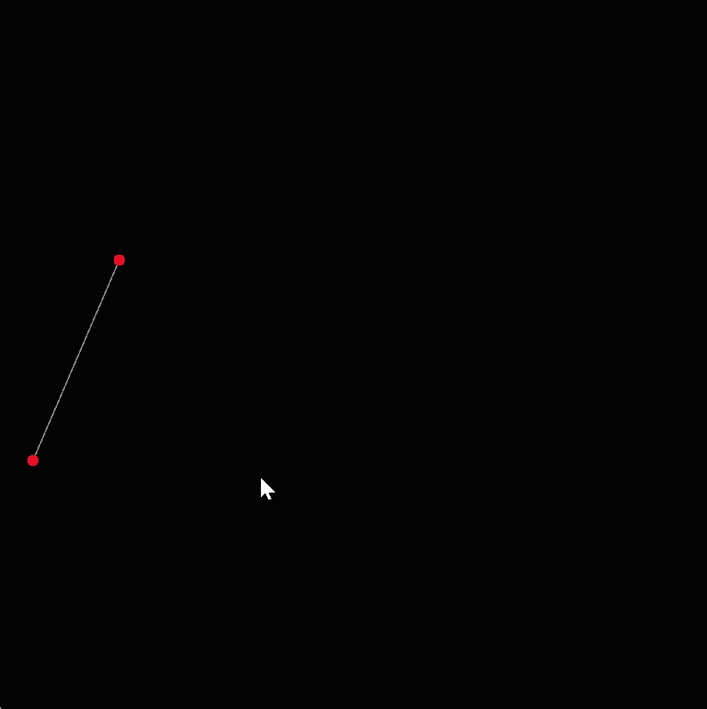
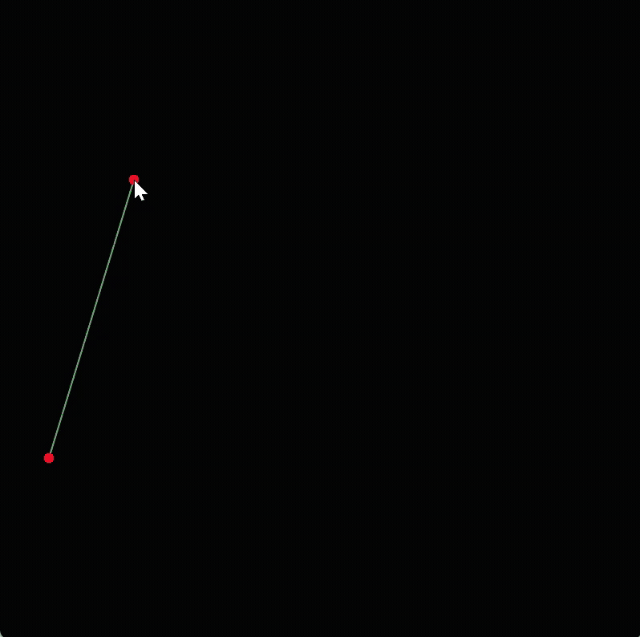
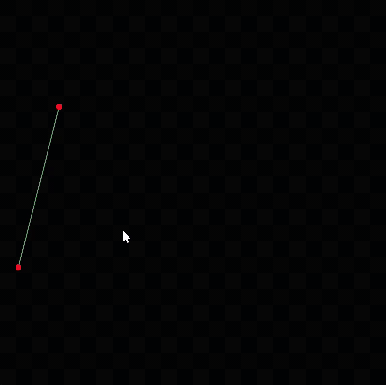

作业完成度说明：完成了“必做+选做”两部分的完整实验，包括了曲线的光栅化绘制、反走样增强、B 样条曲线绘制等功能。

# 1. 项目架构

Work3 相关项目目录结构如下：
```
CG_Lab/
├── pyproject.toml
├── src/
│   └── Work3/
│       ├── __init__.py    --> （包标识文件）
│       ├── config.py      --> 配置模块
│       ├── geometry.py    --> 曲线几何计算模块
│       ├── rasterizer.py  --> GPU光栅化渲染模块
│       └── main.py        --> 主程序入口模块
```


# 2. 代码逻辑
## （1）项目运行入口
在项目根目录（src上级目录）路径下，通过uv执行以下命令：
```
uv run -m src.Work3.main
```

## （2）关键模块说明

a. `config.py` **配置模块**
- 作用：集中定义实验所需的全局参数。
- 内容：包括窗口尺寸、曲线采样数、最大控制点数、颜色配置、绘制样式、对象池容量、反走样开关以及曲线模式标识等。
- 特点：仅保存常量配置，不包含业务逻辑，便于统一调整实验效果。

b. `geometry.py` **曲线几何计算模块**
- 作用：在 CPU 端完成曲线采样点计算。
- 主要函数：
  - `de_casteljau()`：基于递归线性插值计算 Bézier 曲线在参数`t`处的点；
  - `generate_bezier_curve_points()`：批量生成 Bézier 曲线采样点；
  - `uniform_cubic_bspline_point()`：计算均匀三次 B 样条单段曲线点；
  - `generate_uniform_cubic_bspline_points()`：批量生成均匀三次 B 样条曲线采样点。
- 特点：只负责数学计算，与窗口交互和像素绘制解耦。

c. `rasterizer.py` **GPU光栅化渲染模块**
- 作用：基于 Taichi Field 和 Kernel 完成像素缓冲区管理与曲线光栅化。
- 主要内容：
  - 定义`pixels`作为屏幕像素缓冲区；
  - 定义`curve_points_field`接收曲线采样点；
  - 定义`gui_points`和`control_line_vertices`作为固定容量对象池；
  - `clear_pixels()`用于每帧清空画布；
  - `draw_curve_kernel()`用于将归一化曲线坐标映射到像素坐标并点亮像素；
  - `reset_gui_object_pools()`用于隐藏未使用的控制点和线段。
- 特点：承担主要 GPU 并行计算任务，避免 Python 循环中逐点写入 GPU Field。

d. `main.py` **主程序入口模块**
- 作用：组织程序主流程，连接交互、计算、光栅化和显示。
- 执行流程：
  - 初始化 Taichi GPU 环境并创建 GGUI 窗口；
  - 监听鼠标左键添加控制点；
  - 监听`C`键清空控制点；
  - 监听`B`键切换 Bézier / B 样条模式；
  - 每帧清空像素缓冲区；
  - 根据控制点数量和曲线模式生成曲线采样点；
  - 通过`from_numpy()`批量上传采样点至 GPU；
  - 调用 GPU Kernel 绘制曲线；
  - 更新控制点与控制多边形对象池；
  - 将像素缓冲区、控制点和控制多边形显示到窗口。

$\downarrow$

`config.py`提供参数配置 → `geometry.py`计算曲线采样点 → `rasterizer.py`执行 GPU 光栅化 → `main.py`调度交互、计算与渲染，形成完整的交互式曲线绘制系统。


# 3. 实现功能

本实验实现了基于 Taichi 的交互式曲线绘制系统，主要功能如下：
- 支持鼠标左键添加控制点，并以红色圆点实时显示；
- 支持绘制控制多边形，直观展示控制点之间的几何关系；
- 基于 De Casteljau 算法生成 Bézier 曲线；
- 支持 GPU 像素级光栅化，将曲线采样点绘制到`pixels`缓冲区；
- 支持实时更新曲线形态，控制点变化后自动重新计算与渲染；
- 支持`C`键清空控制点并重置画面；
- 使用固定容量对象池管理控制点和控制线段，避免主循环中动态申请显存；
- 使用`from_numpy()`批量上传曲线点，减少 CPU-GPU 通信开销；
- 支持通过`ENABLE_ANTI_ALIASING`开启基于邻域距离衰减的反走样绘制；
- 支持通过`B`键切换 Bézier 曲线与均匀三次 B 样条曲线模式。


# 4. 效果展示

下面是项目的执行效果展示：



通过调整`config.py`中的参数，可实现不同的曲线绘制效果。例如：

（1）改变曲线采样数量（从左到右`NUM_SEGMENTS`依次为100、500、1000），可观察曲线平滑程度：
- 未开启反走样时，曲线仅点亮单个像素，局部边缘存在较明显的阶梯感；
- 开启反走样后，曲线周围像素按距离进行颜色衰减混合，边缘过渡更加平滑。

  

（2）改变反走样开关（左`ENABLE_ANTI_ALIASING = False`，右`ENABLE_ANTI_ALIASING = True`），可观察曲线边缘平滑程度的变化：

 

（3）改变曲线模式（左为 Bézier 曲线模式，右为 Uniform Cubic B-Spline 曲线模式），可观察两类曲线在相同控制点下的形态差异：
- 理论上，Bézier 曲线整体受全部控制点共同影响，曲线更接近全局控制效果；而 Uniform Cubic B-Spline 曲线具有更明显的局部控制特性，形态更加平滑稳定，通常不会经过首尾控制点。
- 实际上，该实验效果差异并不算非常明显。

 