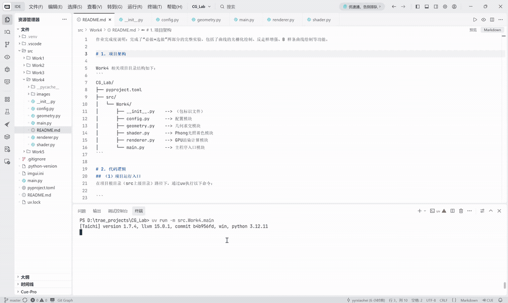
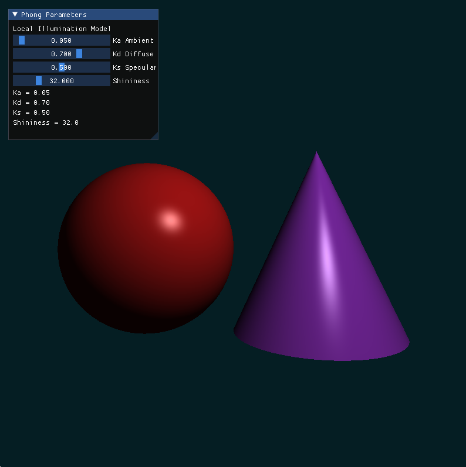
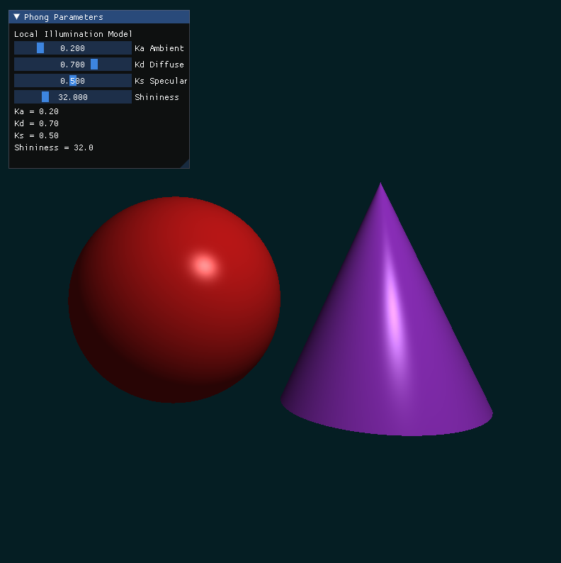
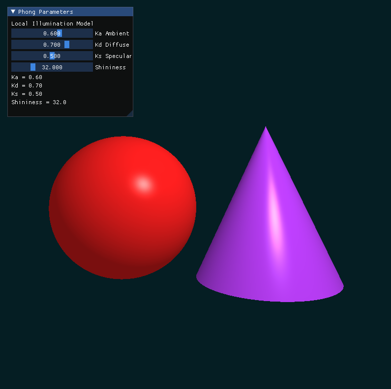
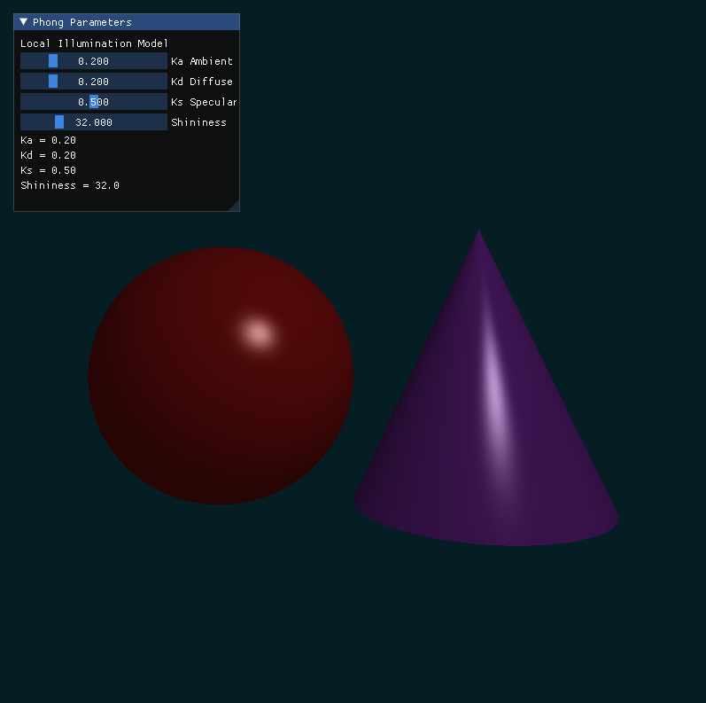
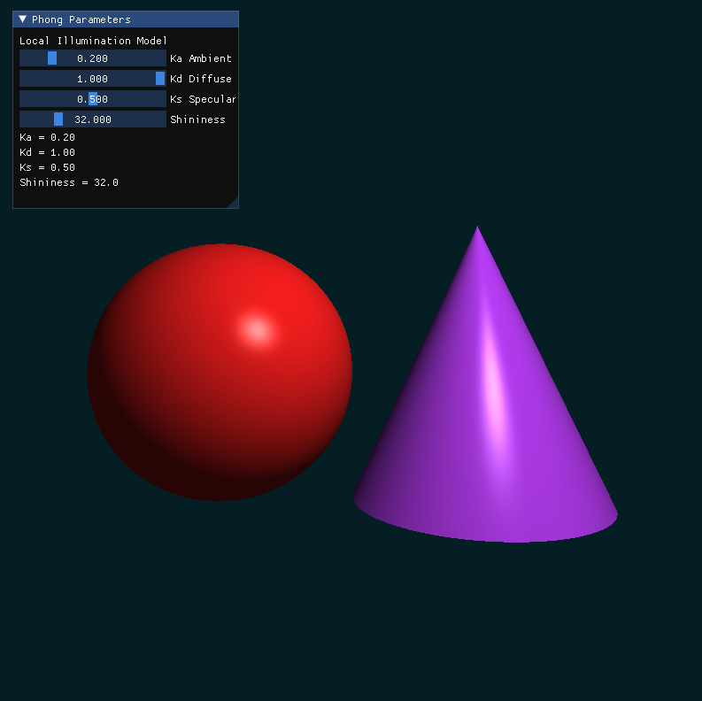
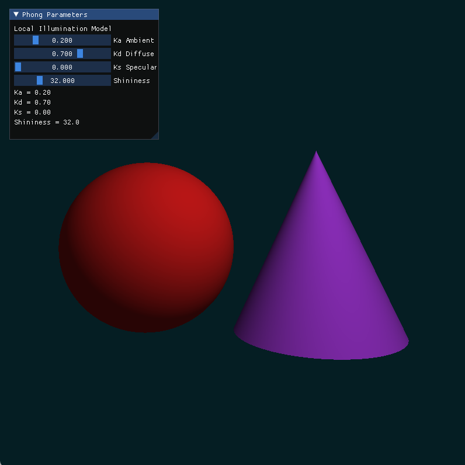
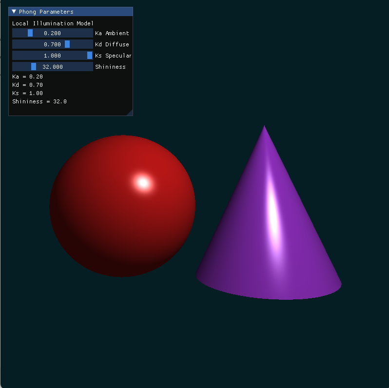
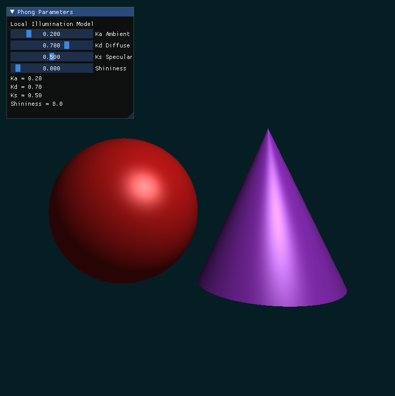
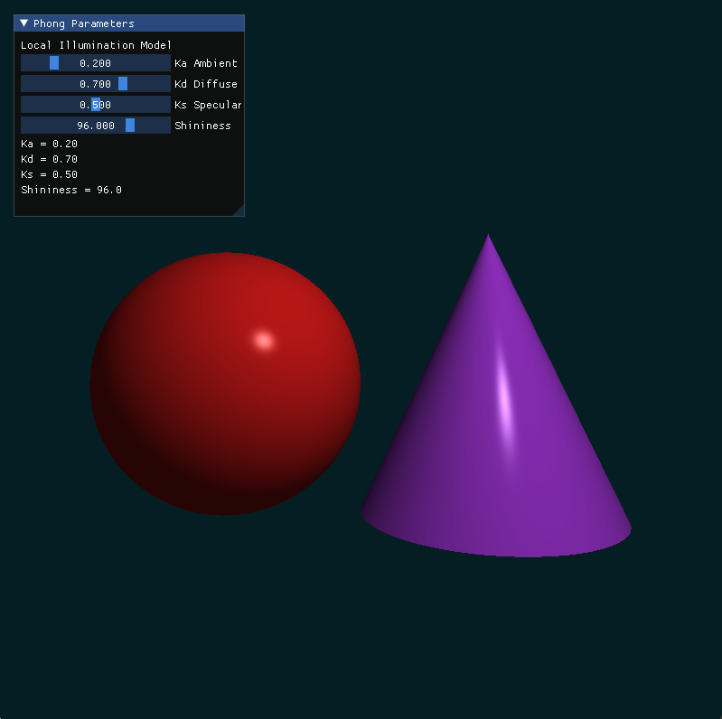

作业完成度说明：完成了“必做+选做”两部分的完整实验，包括了曲线的光栅化绘制、反走样增强、B 样条曲线绘制等功能。

# 1. 项目架构

Work4 相关项目目录结构如下：
```
CG_Lab/
├── pyproject.toml
├── src/
│   └── Work4/
│       ├── __init__.py    --> （包标识文件）
│       ├── config.py      --> 配置模块
│       ├── geometry.py    --> 几何求交模块
│       ├── shader.py      --> Phong光照着色模块
│       ├── renderer.py    --> GPU渲染计算模块
│       └── main.py        --> 主程序入口模块
```

# 2. 代码逻辑
## （1）项目运行入口
在项目根目录（src上级目录）路径下，通过uv执行以下命令：

```
uv run -m src.Work4.main
```

## （2）关键模块说明

a. `config.py` **配置模块**
- 核心作用：统一管理实验中的可调节参数。
- 分组定义：
  - 窗口与成像参数：窗口分辨率、摄像机位置、成像平面范围；
  - 场景参数：球体、圆锥、点光源和背景颜色；
  - 光照参数：`Ka`、`Kd`、`Ks`、`Shininess` 默认值与滑动条范围；
  - 选做开关：Blinn-Phong 模型与硬阴影功能开关。
- 特点：集中存放常量配置，便于修改实验效果，无核心业务逻辑。

b. `geometry.py` **几何求交模块**
- 核心作用：实现射线与三维隐式几何体的求交计算。
- 关键组成：
  - 球体求交：根据球面隐式方程求解射线与球体的最近正交点；
  - 圆锥侧面求交：根据圆锥隐式方程计算交点，并限制交点高度范围；
  - 圆锥底面求交：计算射线与底面平面的交点，并判断是否落在圆盘内部；
  - 法向量计算：在最近交点处计算单位法向量，为后续光照计算提供基础。

c. `shader.py` **Phong光照着色模块**
- 核心作用：根据交点位置、法向量和物体颜色计算最终像素颜色。
- 关键组成：
  - 环境光计算：模拟场景中的基础背景光；
  - 漫反射计算：根据法向量与光照方向夹角表现受光面明暗变化；
  - 镜面高光计算：根据观察方向与反射方向计算高光效果；
  - 颜色裁剪：将最终 RGB 结果限制在合法范围内，避免颜色过曝。

d. `renderer.py` **GPU渲染计算模块**
- 核心作用：基于 Taichi Kernel 实现逐像素 Ray Casting 渲染。
- 关键组成：
  - 像素缓冲区：创建 `pixels` 存储最终画面颜色；
  - 参数 Field：存储由 UI 实时更新的 `Ka`、`Kd`、`Ks`、`Shininess`；
  - 主渲染内核`render_scene()`：为每个像素发射射线，分别检测球体和圆锥交点，并选择最近交点进行 Phong 着色。

e. `main.py` **主程序入口模块**
- 核心作用：统筹程序执行流程，连接 UI 交互与 GPU 渲染。
- 执行流程：
  - 初始化 Taichi GPU 环境；
  - 初始化 Phong 光照参数；
  - 创建 `ti.ui.Window` 交互窗口；
  - 主循环：读取 UI 滑动条参数 → 更新材质参数 Field → 调用 GPU 渲染内核 → 显示渲染结果。

$\downarrow$

**模块协同逻辑**

`config.py`提供统一参数 → `geometry.py`完成几何求交 → `shader.py`完成 Phong 光照计算 → `renderer.py`执行逐像素 GPU 渲染 → `main.py`调度 UI 与画面显示，实现完整交互式局部光照实验。


# 3. 实现功能

基于 Taichi 实现代码驱动的三维局部光照渲染系统，程序通过 Ray Casting 在屏幕上渲染红色球体与紫色圆锥，并支持实时调节 Phong 光照参数，具体功能如下：
- 隐式几何建模：不依赖外部模型文件，直接通过数学方程定义球体与圆锥；
- 光线投射渲染：为每个像素发射射线，计算其与场景物体的交点；
- 深度竞争判断：当射线同时击中多个物体时，选择距离摄像机最近的交点进行着色；
- Phong 光照计算：实现环境光、漫反射、镜面高光三类局部光照效果；
- 实时参数交互：通过 UI 滑动条调节 `Ka`、`Kd`、`Ks` 和 `Shininess`，观察不同材质参数对渲染结果的影响。


# 4. 效果展示

下面是项目的执行效果展示：



（1）通过调整`config.py`中的参数，或在运行窗口中拖动 UI 滑动条，可实现不同的光照渲染效果。例如：

a. 改变环境光系数（从左到右`Ka`依次为0.05、0.20、0.60）：
- `Ka`较小时，背光区域更暗，物体明暗对比更强；`Ka`较大时，整体亮度提高，暗部细节更明显，但立体感会相对减弱。

  

b. 改变漫反射系数（从左到右`Kd`依次为0.20、0.70、1.00）：
- `Kd`较小时，物体受光面的亮度变化不明显；`Kd`增大后，受光面更亮，球体和圆锥的体积感更加突出。

  

c. 改变镜面高光系数（从左到右`Ks`依次为0.00、0.50、1.00）：
- `Ks`为0时，物体表面几乎没有高光，更接近粗糙材质；`Ks`增大后，高光亮斑更加明显，表面光滑感增强。

  

d. 改变高光指数（从左到右`Shininess`依次为8、32、96）：
- `Shininess`较小时，高光范围较大且边缘较柔和；`Shininess`较大时，高光区域更集中，物体表面呈现更强的光滑反射效果。

  

（2）尝试 Phong 模型和 Blinn-Phong 模型两种不同的模型（左为标准 Phong 模型，右为 Blinn-Phong 模型）：
- Blinn-Phong 使用半程向量计算高光，相比标准 Phong 模型，高光边缘通常更加稳定、平滑。

 

（3）开启硬阴影功能（左为关闭硬阴影，右为开启硬阴影）：
- 开启硬阴影后，被其他物体遮挡的区域只保留环境光，物体之间的空间遮挡关系更加明显。

 
