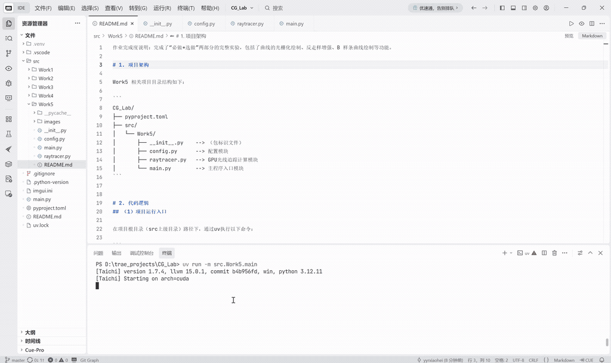
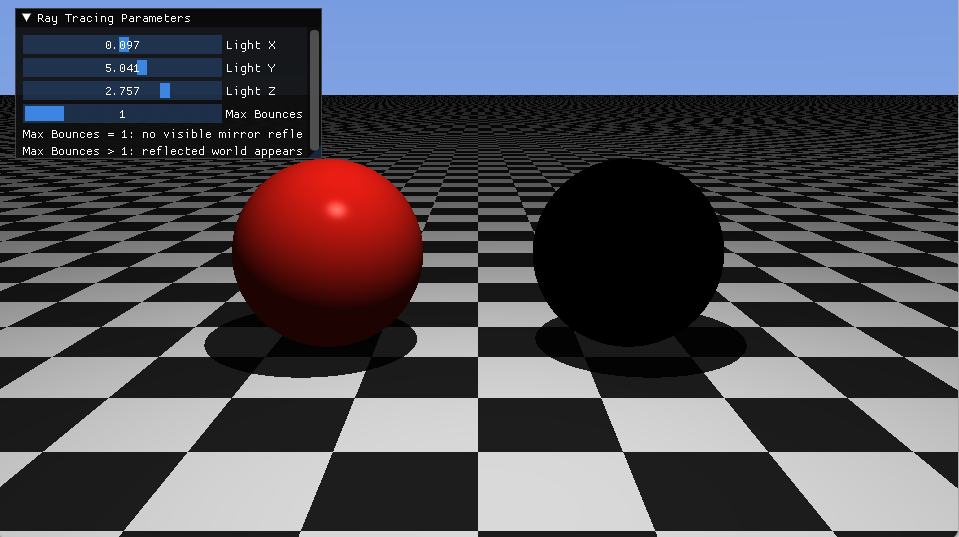
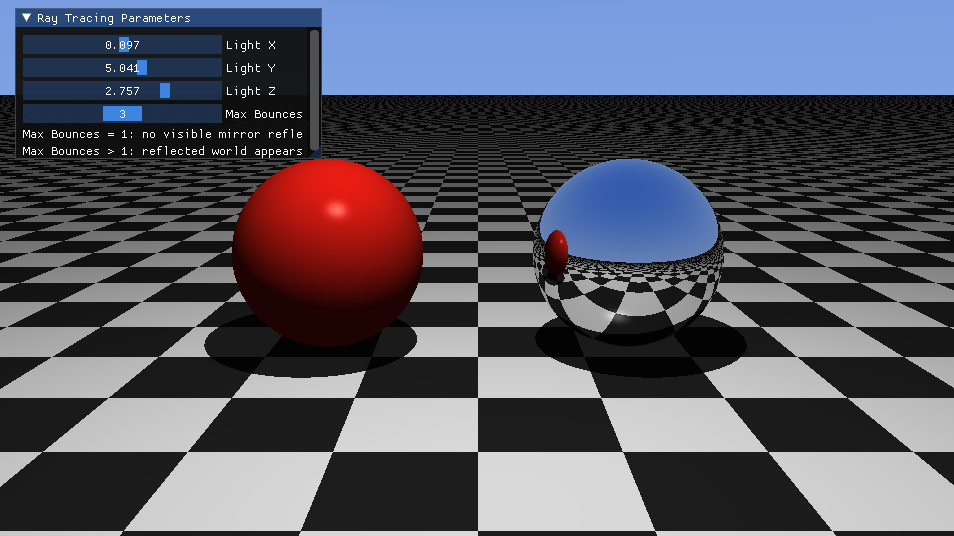

作业完成度说明：完成了“必做+选做”两部分的完整实验，包括了曲线的光栅化绘制、反走样增强、B 样条曲线绘制等功能。

# 1. 项目架构

Work5 相关项目目录结构如下：

```
CG_Lab/
├── pyproject.toml
├── src/
│   └── Work5/
│       ├── __init__.py    --> （包标识文件）
│       ├── config.py      --> 配置模块
│       ├── raytracer.py   --> GPU光线追踪计算模块
│       └── main.py        --> 主程序入口模块
```


# 2. 代码逻辑
## （1）项目运行入口

在项目根目录（src上级目录）路径下，通过uv执行以下命令：

```
uv run -m src.Work5.main
```

## （2）关键模块说明

a. `config.py` **配置模块**

- 核心作用：统一管理光线追踪实验中的固定参数。
- 分组定义：
  - 窗口与图像参数：窗口分辨率、图像宽高；
  - 相机参数：相机位置、观察目标、视场角；
  - 场景几何参数：地面高度、红色漫反射球与银色镜面球的位置和半径；
  - 光照与追踪参数：点光源初始位置、环境光强度、最大弹射次数、射线偏移量等。
- 特点：仅存放常量参数，不包含具体渲染逻辑。

b. `raytracer.py` **GPU光线追踪计算模块**

- 核心作用：基于 Taichi Kernel 实现 Whitted-Style 光线追踪。
- 关键组成：
  - 显存图像缓冲区pixels：存储每个像素最终渲染颜色；
  - 几何求交函数：实现光线与无限大平面、球体的隐式求交；
  - 材质系统：通过材质 ID 区分棋盘格地面、红色漫反射球和银色镜面球；
  - 阴影检测：从交点向光源发射暗影射线，实现硬阴影；
  - 迭代追踪内核render()：使用循环代替递归，实现镜面反射光线的多次弹射。

c. `main.py` **主程序入口模块**

- 核心作用：负责程序启动、窗口创建、UI交互与实时渲染调度。
- 执行流程：
  - 初始化 Taichi GPU 环境；
  - 创建ti.ui.Window窗口与画布；
  - 读取并维护光源位置、最大弹射次数等交互参数；
  - 主循环中实时更新 UI 参数 → 调用 GPU 渲染内核 → 将图像缓冲区显示到窗口。

$\downarrow$

**模块协同逻辑**

`config.py`提供统一参数 → `raytracer.py`基于参数完成 GPU 光线追踪计算 → `main.py`调度 UI 与渲染流程，实现可交互的实时光线追踪效果。


# 3. 实现功能

基于 Taichi 实现一个简化的 Whitted-Style 实时光线追踪系统，能够展示光线投射、硬阴影和理想镜面反射等基础全局光照效果，具体功能如下：
- 隐式场景建模：在 Taichi Kernel 中直接定义无限大棋盘格地面、红色漫反射球和银色镜面球，无需导入外部模型；
- 材质 ID 系统：通过不同材质编号区分漫反射物体与镜面反射物体；
- 迭代式光线弹射：使用循环结构追踪反射射线，避免递归逻辑，更符合 GPU 并行计算方式；
- 硬阴影效果：通过向点光源发射暗影射线，判断交点是否被其他物体遮挡；
- 自相交修正：对反射射线和暗影射线起点进行极小偏移，避免 Shadow Acne 黑色噪点问题；
- UI 实时交互：通过滑动条动态调整点光源位置与最大弹射次数，观察阴影移动和镜面反射变化。


# 4. 效果展示

下面是项目的执行效果展示：



通过调整交互面板中的参数，可观察不同光照与反射效果。例如：

（1）改变点光源位置（从左到右分别调整Light X、Light Y、Light Z）：

  

（2）改变最大弹射次数（左Max Bounces = 1，右Max Bounces = 3）：
- 当Max Bounces = 1时，光线在第一次击中镜面球后不会继续产生有效反射，因此镜面反射效果不明显；当Max Bounces增大后，反射射线能够继续追踪场景，银色镜面球中会出现地面或其他物体的反射结果。

 

（3）硬阴影效果展示：
- 随着点光源位置变化，红色漫反射球和银色镜面球在棋盘格地面上的阴影会同步移动，体现暗影射线遮挡检测的作用。


