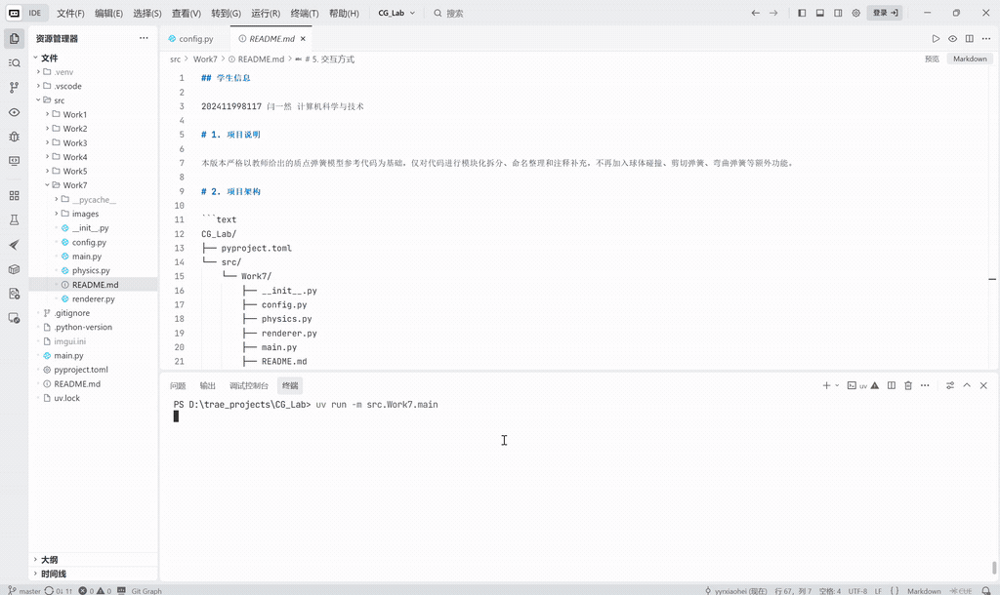
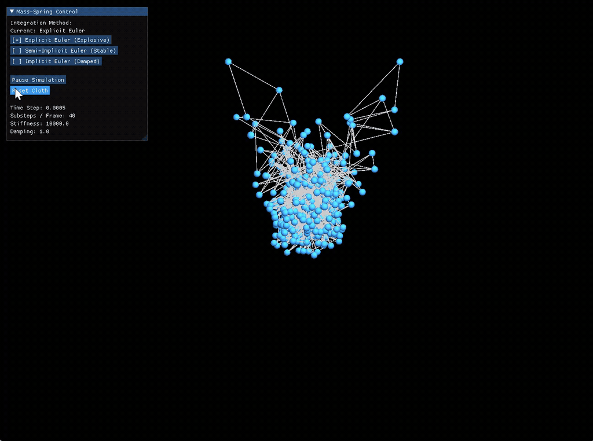

## 学生信息

202411998117 闫一然 计算机科学与技术

# 1. 项目说明

本项目基于 Taichi 实现三维质点弹簧布料模拟，并对比显式欧拉、半隐式欧拉和隐式欧拉三种数值积分方法的稳定性与动态效果。

# 2. 项目架构

```text
CG_Lab/
├── pyproject.toml
└── src/
    └── Work7/
        ├── __init__.py
        ├── config.py
        ├── physics.py
        ├── renderer.py
        ├── main.py
        ├── README.md
        └── images/
            ├── explicit_euler.gif
            ├── semi_implicit_euler.gif
            └── implicit_euler.gif
```

各模块功能如下：

- `config.py`：集中管理窗口、布料、物理模拟和相机参数；
- `physics.py`：实现质点弹簧模型、力学计算和三种积分方法；
- `renderer.py`：负责三维场景、相机和布料线框渲染；
- `main.py`：负责程序入口、交互面板和逐帧调度。

# 3. 运行方法

在项目根目录执行：

```bash
uv run -m src.Work7.main
```

# 4. 实现内容

- 构建 `20 × 20` 的布料质点网格；
- 使用结构弹簧连接水平和竖直相邻质点；
- 固定布料一侧的两个角点；
- 计算重力、阻尼力和胡克弹簧力；
- 使用 `ti.atomic_add` 安全累加弹簧力；
- 使用速度钳制防止严重数值爆炸；
- 实现显式欧拉、半隐式欧拉和隐式欧拉；
- 使用多个 Kernel 分阶段完成初始化；
- 使用 Taichi GGUI 实现三维渲染和交互控制。

# 5. 默认参数

```text
网格分辨率：20 × 20
质点质量：1.0
时间步长：0.0005
结构弹簧刚度：10000.0
阻尼系数：1.0
最大速度：50.0
每帧子步数：40
隐式欧拉迭代次数：3
```

# 6. 操作说明

- 鼠标右键拖动：旋转相机；
- 积分方法按钮：切换三种求解方式；
- `Pause Simulation`：暂停模拟；
- `Resume Simulation`：恢复模拟；
- `Reset Cloth`：重置布料。

# 7. 效果展示与分析

下面是项目的执行效果展示：



其中，可选择对比的三种方法使用相同的网格和物理参数，仅改变数值积分方式。

## 7.1 显式欧拉

显式欧拉使用当前速度更新位置，再使用当前受力更新速度：

\[
x_{t+1}=x_t+v_t\Delta t
\]

\[
v_{t+1}=v_t+a_t\Delta t
\]



布料很快出现剧烈振动、弹簧拉伸和质点聚集。其原因是显式欧拉对高刚度弹簧系统稳定性较差，离散计算会不断引入数值能量。速度钳制只能限制最大速度，不能恢复已经混乱的网格结构。

## 7.2 半隐式欧拉

半隐式欧拉先更新速度，再使用新速度更新位置：

\[
v_{t+1}=v_t+a_t\Delta t
\]

\[
x_{t+1}=x_t+v_{t+1}\Delta t
\]


布料能够自然下垂并保持较完整的网格结构。该方法计算简单，稳定性明显优于显式欧拉，适合实时物理模拟。

## 7.3 隐式欧拉

隐式欧拉使用下一时刻的状态计算受力，本实验通过固定点迭代进行近似求解：

\[
v_{t+1}=v_t+a_{t+1}\Delta t
\]

\[
x_{t+1}=x_t+v_{t+1}\Delta t
\]


布料整体保持稳定，振动衰减速度更快。该方法稳定性最好，但会引入较明显的数值耗散，使运动效果更加平缓。

## 7.4 对比总结

| 积分方法 | 稳定性 | 动态效果 | 主要特点 |
|---|---:|---|---|
| 显式欧拉 | 较差 | 容易振荡并发生结构混乱 | 实现简单，但容易数值增能 |
| 半隐式欧拉 | 较好 | 下垂自然，振动较明显 | 兼顾效率与稳定性 |
| 隐式欧拉 | 最好 | 振动衰减快，运动平缓 | 稳定，但数值耗散较强 |

实验结果表明，数值积分方法会直接影响质点弹簧系统的稳定性。半隐式欧拉较适合实时模拟，隐式欧拉适合强调稳定性的场景，而显式欧拉可用于直观展示数值不稳定现象。
